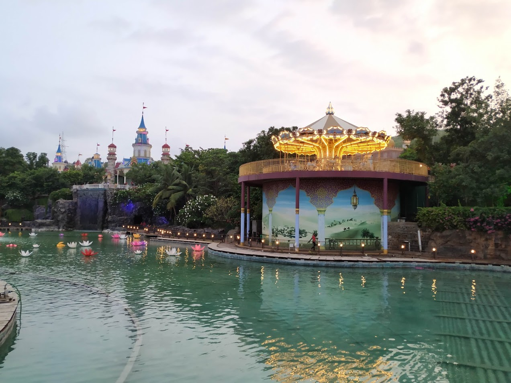

[Adlabs Imagica](https://www.adlabsimagica.com/) is a serenic place in outskirts of Mumbai with lots of activities to do. One can go for a weekend getaway and enjoy the destination's offerings i.e. Theme park, Water park, Snow park, etc.It does give the thrill and a sense of adventure to its visitors.Various attrations at the theme park include the rides namely Nitro, Scream Machine, Dare 2 Drop, etc.

I had been to Imagica's theme park last weekend with friends and siblings. The experience might have been a better one only if we did not have to waste most of our time waiting in queues for our turn. Through this post I intend to share my experience being in there. I noticed a few key points that are of concern:

1. When you buy tickets you are not briefed about the two types of tickets i.e. regular and express. The difference being express entries get preference over regular ones for entry to rides (which creates a sense of difference).

2. There is no indicator on the maps provided about the rides belonging strictly to kids/adults.Due to which people locate and travel up to the ride only to know that they are not allowed to board that ride.

3. They possess monopoly in foods.You cannot get outside food inside Imagica which leaves you no option other than their expensive canteens.

4. All the rides have a capacity of 16 - 20 people at a time which results in huge queues and the queue remains intact when express entries are already present (worses when express entries keep coming).

All of these added up to the bitter part of the overall experience. We could not finish all the rides in a day and did not get value for money. Nevertheless, the view inside Imagica is splendid and the glow of flowers inside the mini pond in evening is relaxing, company of good friends simply adds up to the beauty.

