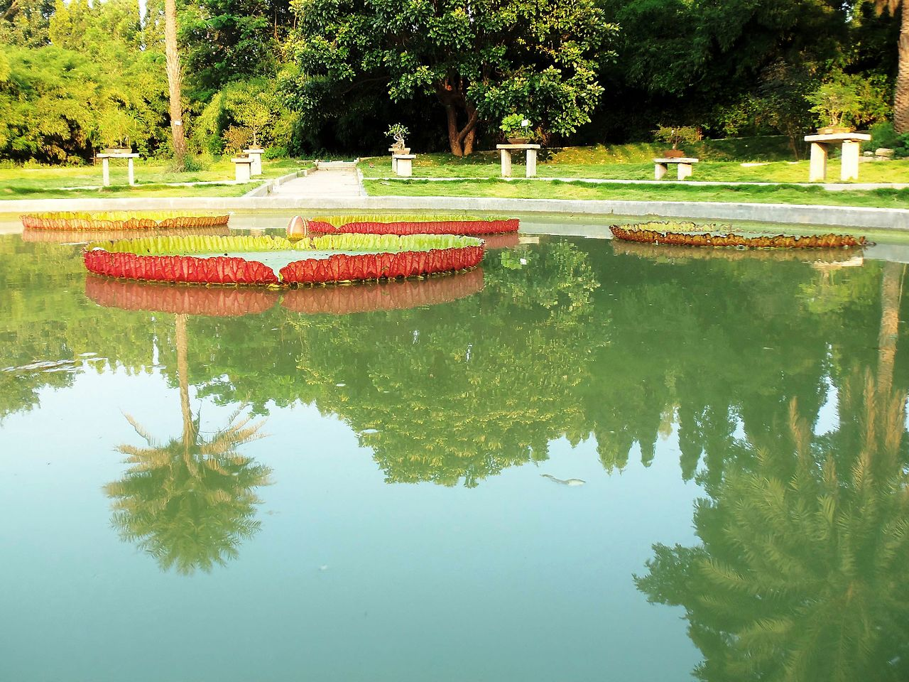

Bangalore has this very old and famous botanical garden called Lalbag. The other night my flatmate suggested that we go somewhere and have some fun rather than having the same old lazy weekends. The imprompt decision was to go to Lalbag.

There are many activities carried out in here by various groups. It's a scenic view to see people from all age groups indulged in variety of activities.

We happened to visit Lalbag for bird watching which is conducted by a group named bngbirds led by Mr. Prasad . Witnessed enthusiasts from diverse backgrounds carrying binoculars, books consisting of different species found in Indian subcontinent.

It was only when Mr. Prasad started taking us through various types of birds I realised we are so less observant of our surroundings, nature. Birds can be classified based on the size, structure of their wings, tail, beak in to families. Pertaining to the way the birds behave with each other one can identify the gender of the bird.

Indeed, going out in nature gives us a new perspective towards life and relaxes our mind like nothing else. Nonetheless, it's customary to go to MTR (Mavalli Tiffin Rooms) for a wholesome breakfast. People are crazy about this place. At 10 am in morning we had to wait in queue to get a table. In the end the taste of the food made it evident that the wait was worth it. Thoroughly enjoyed this mini weekend getaway!

Fun fact: Pigeons also known as Rock Doves adapt well to cities because they find there habitat similar to the cliffs where they live in the wild.

